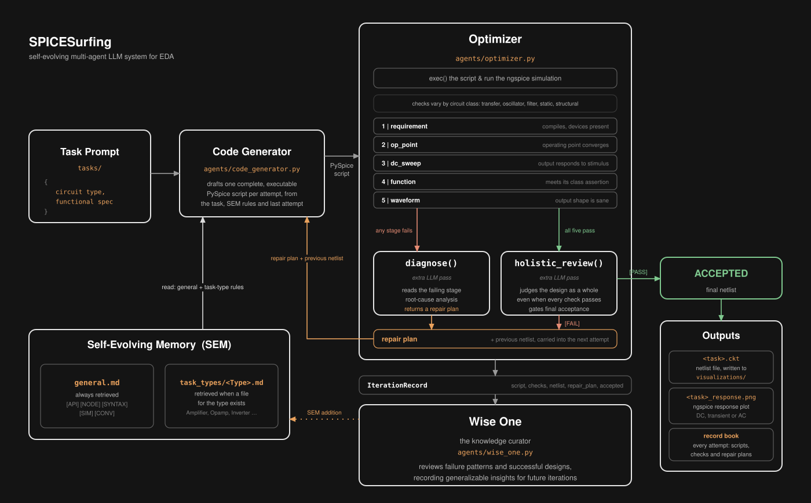
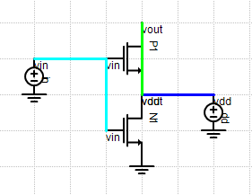
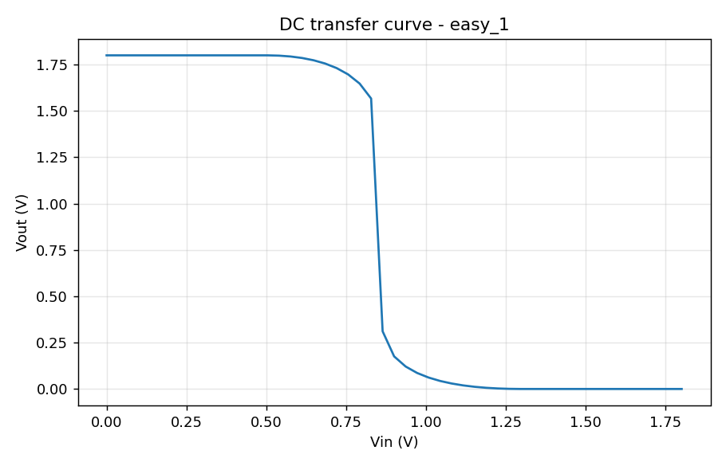

# SPICESurfing


A multi-agent system that turns natural-language circuit descriptions into validated, simulated circuits.

Given a circuit spec, three LLM agents iteratively produce and validate netlists, improving as they go: a code generator writes a PySpice script, a design optimizer tests it against real ngspice simulations and reviews the design, and a knowledge curator distills what was learned into a Self-Evolving Memory (SEM) that makes future runs smarter.

- [Example Usage](#usage)
- [Setup](#getting-started)
- [Future work](#future-work)

## Features

- **Self-Improving Multi-Agent Loop**: each attempt runs generation, validation, and knowledge curation as separate agents, with the optimizer's repair plan and the previous netlist feeding the next attempt's PySpice generation
- **Class-Aware Circuit Validation**: a five-stage check suite with per-family profiles for ~25 circuit types, so amplifiers are judged on gain, oscillators on sustained self-oscillation, etc., instead of one size fits all assertions
- **Holistic Filtering**: since the deterministic circuit optimization stages can't always perfectly assess circuit functionality, scripts that pass every quantitative check face an additional LLM scrutiny phase, which returns either [PASS] or [FAIL] depending on whether the agent deems the circuit functional when its script is read against the original task spec
- **Self-Evolving Memory (SEM)**: the curator writes atomic, tagged rules into general and circuit type-specific markdown files, retrieved selectively by task type; admission criteria and a [NO WRITE] default keep notes deduplicated and high quality
- **Provider-agnostic inference**: run the whole pipeline on OpenAI, Claude, or a local Ollama model with one CLI flag
- **Visualization**: render the accepted netlist as a schematic in [netlist-viewer](https://github.com/fwilson12/netlist-viewer) and plot the simulated response

## Architecture

<p align="center">
  
  <br>
  <em>made with <a href="https://app.diagrams.net">draw.io</a></em>
</p>

`main.py` drives an iteration loop of up to `--max_attempts` cycles. The **code generator** drafts a complete PySpice script from the task description, the SEM's rules, and (after attempt one) the previous iteration's netlist and repair plan. The **optimizer** executes the script and runs the five-stage check suite, where a circuit-type profile decides which stimulus (DC sweep, transient analysis, etc.) drives the later stages and which assertions apply; on the first failure it queries the LLM for a repair plan, and on a full pass it performs a holistic review that determines final acceptance. The **knowledge curator** then reviews the complete iteration record and elects whether to append general and/or circuit type-specific rules to the SEM. All three agents share one inference source chosen at startup (`llm.py`), and all simulations come from ngspice via PySpice.

## Tech stack

|               |                                                                           |
| ------------- | ------------------------------------------------------------------------- |
| Simulation    | PySpice / ngspice                                                         |
| LLM           | OpenAI, Anthropic, or Ollama, selectable via `--llm`                      |
| Validation    | numpy-based five-stage check suite                                        |
| Memory        | markdown SEM (general + per-circuit-type files)                           |
| Visualization | matplotlib, [netlist-viewer](https://github.com/fwilson12/netlist-viewer) |

## Project structure

```text
SPICESurfing/
├── main.py             # CLI entry; attempt loop, record book
├── llm.py              # LLM source (--llm openai | claude | ollama)
├── schema.py           # dataclasses shared between agents
├── agents/
│   ├── code_generator.py   # drafts PySpice scripts from task + SEM + repair plan
│   ├── optimizer.py        # five-stage check suite, diagnosis, holistic review
│   └── wise_one.py         # knowledge curator; distills rules into the SEM
├── SEM/
│   ├── general.md          # always-retrieved general rules
│   └── task_types/         # per-circuit-type insights (Amplifier.md, Inverter.md, ...)
├── tasks/              # 114-task benchmark: easy / medium / hard / extreme JSON specs
├── visualizations/     # saved netlists (.ckt) and response plots from accepted runs
├── docs/               # architecture diagram and figures
├── requirements.txt
└── THIRD_PARTY_LICENSES    # license for the benchmark tasks adapted from SPICEPilot
```

## Usage

### A simple example: CMOS inverter

Tasks are JSON files in `tasks/`, a 114-task benchmark spanning four difficulty tiers (easy, medium, hard, extreme). A task gives only a name, a functional description and a circuit type:

```json
{
  "name": "CMOS Inverter (NOT Gate)",
  "description": "Uses one NMOS and one PMOS transistor connected in series between Vdd and ground. Input is connected to both gates; output is taken from the connection between the transistors. When the input is high, NMOS conducts, pulling output low; when input is low, PMOS conducts, pulling output high.",
  "circuit_type": "Inverter"
}
```

Run it, rendering the schematic and the response on success:

```bash
python main.py --task tasks/easy_1.json --max_attempts 10 --visualize --plots
```

The `circuit_type` (`Inverter`) selects both the SEM file consulted during generation and the validation profile used to judge the result, in this case a DC transfer sweep with a switching-gain assertion rather than the oscillation or filtering checks other classes get

A passing attempt looks like:

```text
============================================================
  ATTEMPT 2 OF 10  |  CMOS Inverter (NOT Gate)  |  openai/gpt-5.1
============================================================
--- Validating ---
  [PASS] requirement   Netlist compiled; ground, output node and required devices present.
  [PASS] op_point      DC operating point converged.
  [PASS] dc_sweep      Vout responds to the input sweep; not rail-stuck.
  [PASS] function      Functional: max |dVout/dVin| = 42.5 V/V.
  [PASS] waveform      Waveform valid: swing=1.8V, monotonic fraction=1.00.
--- ACCEPTED on attempt 1 ---
```

On failure, the optimizer diagnoses the failing stage and hands the generator a targeted repair plan for the next attempt

The accepted circuit is saved as a netlist in `visualizations/`:

```text
.title CMOS_Inverter
Vdd Vdd 0 1.8V
Vin Vin 0 0V
MP1 Vout Vin Vdd Vdd PMOS_CORE l=1.8e-07 w=1e-06
MN1 Vout Vin 0 0 NMOS_CORE l=1.8e-07 w=5e-07
.model NMOS_CORE nmos (gamma=0.6 kp=0.00012 lambda=0.02 phi=0.7 vt0=0.5)
.model PMOS_CORE pmos (gamma=0.6 kp=4e-05 lambda=0.02 phi=0.7 vt0=-0.5)
```

<p align="center">
  
  &nbsp;&nbsp;&nbsp;
  
  <br>
  <em>the accepted netlist rendered as a schematic (--visualize), and its simulated DC transfer curve (--plots)</em>
</p>

### How each circuit class is judged

The same five checks run for every task, but the profile for the task's `circuit_type` decides what "working" means:

| Circuit class                                              | What the checks look for                                             |
| ---------------------------------------------------------- | -------------------------------------------------------------------- |
| `Amplifier`, `Opamp`                                       | DC sweep with a minimum small-signal gain                            |
| `Inverter`, `LogicGate`, `Comparator`, `Schmitt`, `Switch` | DC transfer curve, switching behavior and full output swing          |
| `Oscillator`, `VCO`                                        | transient run showing sustained self-oscillation                     |
| `Filter`                                                   | AC sweep with measurable frequency shaping                           |
| `CurrentMirror`, `BiasCircuit`, `VoltageReference`         | operating point with devices held in saturation                      |
| `ADC`, `DAC`, `PLL`, `Latch`, `Mixer`, other system blocks | structure and bias only; analog probes are skipped as not applicable |

### Other options

Pick the inference source with `--llm` and optionally a specific model with `--model`; all three agents use the same source, and the run header displays the active provider/model:

```bash
python main.py --task tasks/medium_7.json --llm claude
python main.py --task tasks/hard_3.json --llm openai --model gpt-5.1
python main.py --task tasks/easy_2.json --llm ollama --model qwen3.5:9b
```

Optional flags for the final accepted circuit:

- `--visualize`: render the netlist as a schematic in netlist-viewer (`--viewer` or `NETLIST_VIEWER_EXE` points at the executable)
- `--plots`: save and open the simulation response (DC transfer curve, transient, or AC magnitude)

`--visualize` is entirely optional; the pipeline runs and accepts circuits without it. It invokes [netlist-viewer](https://github.com/f18m/netlist-viewer), a SPICE schematic viewer, passing the generated `.ckt` file as an argument. That last part needed a small tweak, so [my fork](https://github.com/fwilson12/netlist-viewer) adds the ability to launch the executable from the command line with a netlist path. To use it, build the fork following the repo's build instructions, then point `--viewer` or the `NETLIST_VIEWER_EXE` environment variable at the resulting `netlist_viewer.exe`

## Getting started

### Prerequisites

- Python 3.11+
- An API key for your chosen provider (OpenAI or Anthropic), or a local [Ollama](https://ollama.com) install with the model pulled

### Setup

Create the environment and install dependencies:

```bash
conda create -n SPICE python=3.11
conda activate SPICE
pip install -r requirements.txt
```

PySpice needs a local ngspice installation:

```bash
pyspice-post-installation --install-ngspice-dll
```

Create `.env` at the repo root with the key for the provider you plan to use (only that provider's key is required):

```env
OPENAI_API_KEY=your_key_here
ANTHROPIC_API_KEY=your_key_here
```

Then run a task:

```bash
python main.py --task tasks/easy_1.json --llm openai
```

Defaults per provider: `openai=gpt-5.1`, `claude=claude-opus-4-8`, `ollama=qwen3.5:9b`.

## Future work

- **LLM-Authored Validation**: validation is currently deterministic: `PROFILES` maps a task's `circuit_type` to a fixed profile, so every `Opamp` is judged against the same gain threshold, and any type without an entry falls back to structure and bias only. The next step is to let an agent read the task spec and write the test plan itself, choosing the stimulus, the measurements and the pass thresholds for that specific circuit
- **Prompt-to-Pedal**: once I'm back in my university's electronics lab this fall, I think it'd be awesome to build a guitar pedal from scratch using SPICESurfing to generate the netlist for a distortion or compressor pedal that I can turn into a custom PCB.

## Acknowledgements

SPICESurfing is an independent project built on ideas and materials from prior work. It is not affiliated with or endorsed by any of the groups below.

- **AnalogAgent**, [Self-Improving Analog Circuit Design Automation with LLM Agents](https://arxiv.org/abs/2603.23910) (arXiv:2603.23910), is what this framework was inspired by: a code generator, a design optimizer and a knowledge curator working over a self-evolving memory, and the staged design/execute/diagnose/refine cycle that the five check stages here are modeled on. No code from that work was used, as none has been public as of yet
- **SPICEPilot**, [Navigating SPICE Code Generation and Simulation with AI Guidance](https://arxiv.org/abs/2410.20553) (arXiv:2410.20553, [ACADLab/SPICEPilot](https://github.com/ACADLab/SPICEPilot)), is the source of the benchmark tasks; the task specifications in `tasks/` are adapted from it, along with its easy/medium/hard/extreme tiering. SPICEPilot is MIT licensed, and its license is reproduced in [`THIRD_PARTY_LICENSES`](THIRD_PARTY_LICENSES).
- **netlist-viewer**, [f18m/netlist-viewer](https://github.com/f18m/netlist-viewer), is the schematic viewer behind the optional `--visualize` flag. All of the schematic rendering is its work; my fork only adds a command-line entry point so the executable can be handed a netlist path
